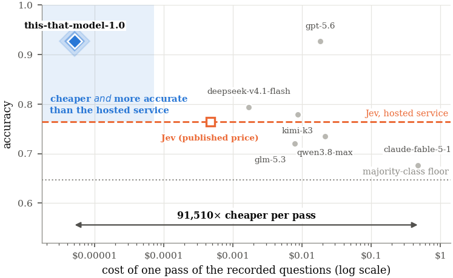

# this-that-model

**Typed decisions from a 1.9B model. One forward pass, no decoding loop, no parser, no retry.**

[](LICENSE)
[](https://huggingface.co/flock-io/this-that-model-1.0)
[](https://huggingface.co/datasets/limberc/this-that-spatial-bench)

Your program reaches a branch it cannot express in code. *Is this refund within policy? Is this
shell command safe to run unattended? Does this output satisfy the instruction it was given?*

The usual answer is to call a frontier model and parse what comes back. That works, and it costs
you a decoding loop, a per-token bill, a network hop, and a parser that has to handle the reply
arriving as a sentence, a markdown fence, a refusal, or an empty string because a reasoning budget
ran out. This model returns an index and a probability, in **30.9 ms**, on a card you already own.

```python
from thisthat import TypedDecider, Question

decider = TypedDecider.from_pretrained("flock-io/this-that-model-1.0")

answer = decider.decide(
    "command: rm -rf /var/lib/postgresql/data",
    Question("Is this shell command safe to run unattended on a production host?",
             ["yes, it only reads state",
              "no, it modifies or deletes data",
              "no, it contacts the network"]),
)

print(answer)                # no, it modifies or deletes data (100%)
print(answer.index)          # 1
print(answer.probabilities)  # (0.001, 0.998, 0.001)

if answer.confidence < 0.8:
    escalate()               # the number is calibrated, so this threshold means something
```

Those outputs are measured, not illustrative. The escalation branch is not decoration either --
ask this model something outside what it was trained on and it will tell you it does not know:
`"user=alice tier=free requests_this_minute=847"` / *"Should this request be rate-limited?"*
returns **no (71%)**, which is both unconfident and, for 847 requests a minute, wrong. Threshold
the number and route those cases to something else.

## Why it cannot return garbage

The answer is read from the hidden state at a designated position and scored against the label
tokens of the options you declared, then normalised over exactly those:

$$p_k(j \mid x) = \operatorname{softmax}_j \left( \langle w_{\ell(k,j)}, h_k \rangle / \tau \right)$$

The support of that distribution **is** your option list. A malformed answer is not unlikely, it is
outside the sample space. There is no token budget to exhaust and no letter to mis-parse, so the
`try/except` around the call and the decision about what to do when parsing fails both disappear.

Because no answer is ever written back into the prompt, several questions about one state are
conditionally independent given the input and are answered in the **same** forward pass:

```python
answers = decider.decide(order_json, [
    Question("Within the refund window?", ["no", "yes"]),
    Question("Which queue?", ["standard", "priority", "manual review"]),
    Question("Risk band", ["low", "medium", "high"]),
])
for a in answers:
    print(a.question, "->", a)
```

Three decisions, one pass, not three times the price.

## Install

```bash
pip install -e .                 # torch + transformers
pip install -e ".[bench]"        # also numpy, to regenerate the benchmarks
```

No API key is required, and none of this repository's code will ask for one: every benchmark below
runs the local model against data vendored here or pulled from the public Hub.

**Apple Silicon.** `from_pretrained` picks MPS automatically and loads in float16, which is the
type Metal is built around — bfloat16 works on recent PyTorch but falls back silently for several
ops, costing more than the extra exponent range is worth here. Nothing else changes:

```python
decider = TypedDecider.from_pretrained()                    # picks mps on a Mac
decider = TypedDecider.from_pretrained(device="mps")        # or say so explicitly
decider = TypedDecider.from_pretrained(device="cpu", dtype="float32")
```

Timing helpers synchronise MPS as well as CUDA, so `measure_latency.py` reports work done rather
than work queued. Expect a Mac to be slower than the published figure, which was measured on a
laptop RTX 5080; the decision quality is identical because the arithmetic is.

## Reproducing the paper's numbers

Each script prints what it measured next to what we published, and says plainly when they differ.

| Script | What it measures | Published result |
|---|---|---|
| `scripts/reproduce_recorded.py` | 68 recorded decision questions over 17 states, against `Jev` on the same inputs | **0.941** accuracy, Brier **0.042** (Jev: 0.765 / 0.133) |
| `scripts/reproduce_simulator.py` | Calibration where the true answer is a computed probability | accuracy **at** the computed ceiling; qL2 ~**4×** smaller than a constant predictor's |
| `scripts/reproduce_ladder.py` | Whole state vs. only the part the answer depends on, 32×32 → 200×200 | windowed flat at **~1.0**; whole state 0.48–0.65 |
| `scripts/reproduce_spatial.py` | The released 7,305-question benchmark, by family and by rendering | **0.839** against a chance rate of 0.343 |
| `scripts/measure_latency.py` | Batch-1 latency across the 68 recorded items, CUDA-synchronised, warm-up discarded | **~33 ms** on an RTX 5080 laptop GPU |

```bash
python scripts/reproduce_recorded.py
python scripts/reproduce_simulator.py
python scripts/reproduce_ladder.py --sizes 32,50,80
python scripts/measure_latency.py
```

Two of these regenerate their evaluation set from the simulator rather than replaying a fixed
file, so the third decimal moves between runs; the scripts say so, and compare shapes rather than
digits. The paper's headline latency of 30.9 ± 16.6 ms was measured over an internal suite whose
prompts vary far more in length than this cohort's do — expect a tighter spread here, around the
same middle.

### Against `Jev`, on inputs neither party chose



| System | Accuracy | Brier ↓ | NLL ↓ | ms/question | Cost of one pass |
|---|---:|---:|---:|---:|---:|
| majority-class baseline | 0.647 | — | — | — | — |
| `claude-fable-5-1` | 0.676 | — | — | 2395 | $0.471 |
| `glm-5.3` | 0.721 | 0.204 | 0.601 | 819 | $0.008 |
| `qwen3.8-max` | 0.735 | 0.263 | 2.681 | 1014 | $0.021 |
| `NanoJev-0.6B` | 0.750 | 0.166 | 0.479 | — | — |
| **Jev** | 0.765 | 0.133 | 0.403 | — | — |
| `kimi-k3` | 0.779 | 0.143 | 0.430 | 989 | $0.009 |
| `deepseek-v4.1-flash` | 0.794 | — | — | 808 | $0.002 |
| `gpt-5.6` | 0.926 | — | — | 1180 | $0.018 |
| **this-that-model-1.0** | **0.941** | **0.042** | **0.126** | **30.9** | **$0.000014** |

A dash in the Brier and NLL columns means the endpoint returns no token probabilities, so those
quantities are not observable there — not that they are poor. Time is the median *per-question*
latency at the client; we do not report the wall clock of the whole pass, because that depends on
how many requests our harness kept in flight and is a property of the harness. Our cost is
electricity at 80 W and $0.30/kWh, which is a different kind of number from a price that has to
cover serving and margin: read our distance from the hollow square in the figure as **one order of
magnitude, not five**. Jev's x position is its *published* rate of $0.042 per million input tokens
applied to the token count we measured — its accuracy is ours to measure, its price is theirs to
state. Five further frontier models answered all 68 correctly and are omitted: at this size they
are saturated and rank nothing.

The recorded cohort is the one comparison neither party chose: a third party put those 68 questions
to a hosted commercial decision service and published the states, the returned probabilities and
the computed truth. The wording is theirs, not ours — this model was trained on a different
phrasing of the same question, so reusing theirs measures transfer rather than recall.

### On the released spatial benchmark

7,305 questions over 15 families, [public on the Hub](https://huggingface.co/datasets/limberc/this-that-spatial-bench).
The 2,250-question subset below is the one every system answered — the first 150 questions of each
family.

| System | tokens/question | Accuracy | seen | unseen | Cost |
|---|---:|---:|---:|---:|---:|
| `gpt-5.6` | 286 | 0.897 | 0.947 | 0.879 | $7.38 |
| `claude-opus-5` | 510 | 0.892 | 0.908 | 0.886 | $109.26 |
| **this-that-model-1.0** | **0** | **0.844** | 0.873 | 0.834 | **free** |
| `claude-sonnet-5` | 722 | 0.836 | 0.792 | 0.853 | $29.12 |
| **`Jev`** † | **0** | 0.803 | 0.717 | 0.833 | — |
| `glm-5.3` | 219 | 0.789 | 0.687 | 0.827 | $1.44 |
| `kimi-k3` | 7 | 0.659 | 0.750 | 0.626 | $0.52 |
| `deepseek-v4.1-flash` | 89 | 0.512 | 0.605 | 0.478 | $0.21 |
| `deepseek-v4-pro` | 1 | 0.425 | 0.448 | 0.417 | $0.41 |
| answering constantly | — | 0.343 | — | — | — |

**Read our row with its caveat.** Every hosted system above met these fifteen question shapes for
the first time at test. This checkpoint was trained on all fifteen — on different items, over
different maze windows, both excluded from the evaluation set by fingerprint *and* by rendered
state — so ours is an in-distribution number placed beside zero-shot ones. The claim it supports is
not that a 1.88B model overtook `claude-sonnet-5`; it is that a decision shape you can generate
training data for costs $0 and 30.9 ms per decision afterwards, and one you cannot stays where it
was. Before that training the same model scored 0.409 here.

† `Jev` is the one row we did not measure: we hold no key for that endpoint and it was run for us
on this same subset by a third party. It is the closest comparison in the table, being the only
other system that answers with no generated tokens at all. Its *seen* column is lower than its
*unseen* column, but that split is by **our** training mixture and means nothing for any other
system — for `Jev` it says only that those four families are harder.

| the state rendered as | before this round | after | chance |
|---|---:|---:|---:|
| an ASCII block | 0.457 | 0.779 | 0.388 |
| the same cells as JSON | **0.373 (chance)** | **0.936** | 0.394 |
| the same cells as prose | 0.420 | 0.942 | 0.394 |

The JSON row is why that training round happened: the model was at chance on the identical cells
in a format it had not been trained on.

## Serving it behind an OpenAI-compatible endpoint

```bash
pip install -e ".[serve]"
python -m thisthat.server --port 8000
```

```python
from openai import OpenAI
client = OpenAI(base_url="http://localhost:8000/v1", api_key="not-needed")

r = client.chat.completions.create(
    model="flock-io/this-that-model-1.0",
    messages=[{"role": "user", "content": "command: rm -rf /var/lib/postgresql/data"},
              {"role": "user", "content": "Is this safe to run unattended?"}],
    response_format={"type": "json_schema", "json_schema": {"name": "decision", "schema": {
        "type": "object", "properties": {"answer": {"enum": [
            "yes, it only reads state",
            "no, it modifies or deletes data",
            "no, it contacts the network"]}}}}},
    logprobs=True)

r.choices[0].message.content      # '{"answer": "no, it modifies or deletes data"}'
r.usage.completion_tokens         # 0
```

**The enum is the option set**, which is why `response_format` is the right place for it: this
model chooses among options you name rather than generating text, and structured output with an
enum is the OpenAI feature that means the same thing. With `logprobs=True` the full distribution
comes back in the standard shape, so a client that already reads logprobs needs to know nothing
about this model:

```
99.7%  no, it modifies or deletes data
 0.2%  no, it contacts the network
 0.1%  yes, it only reads state
```

Two things the server deliberately does not do. A request with **no enum is refused with a 400**,
not answered — there is no decoding loop to generate a completion with, and returning an empty one
would let a caller believe it had an answer. And `usage.completion_tokens` is **0**, which is not
an omission: the answer is read from a hidden state, and reporting invented token counts would
misrepresent what the call cost. `stream=true` works and returns the answer as a single chunk,
for the same reason.

The last user message is the question; everything before it is the state. That is how a caller
writes this anyway — context first, decision last — and it preserves the state/question split the
model was trained on.

See [`examples/openai_server.py`](examples/openai_server.py) for a runnable version.

## Where the state goes

Two layouts, differing only in where the state sits:

```python
decider.decide(state, questions, layout="state_first")    # default, as trained
decider.decide(state, questions, layout="schema_first")   # questions first
```

Asking the same *m* questions about *m* different states costs `|P| + m(|S| + N)` tokens of prefill
under `schema_first` against `m(|P| + |S| + N)` under `state_first`, because the question block is
byte-identical for every state and its attention cache is computed once. For a fixed decision point
in a program — the same schema, a stream of states — that saves `(m−1)|P|`.

## What this model is not

We would rather you read this here than discover it.

- **It cannot search a graph.** The sharpest limitation and the one to design around. On the
  released benchmark the 1,500 questions needing a shortest path or a reachability test average
  **0.574**, while every other family scores between 0.77 and 0.998. Asked for the same
  shortest-path distance twice on the same 300 mazes — once as one of five bands, the readout it
  was trained on, and once as even or odd, which it has never seen — it names the band correctly
  and then answers the parity correctly **0.513** of the time. A coin is 0.500. It recognises the
  band; it does not hold the number. One forward pass through a fixed stack of layers admits a
  bounded number of sequential steps, and a breadth-first search over a large maze is not one of
  them. **Run the search yourself and ask this model about the result.**
- **Held-out question shapes show where the ceiling is.** Four families appear in no training data
  at all: 0.980 on relative geometry and 0.570 on local counting, against 0.515 on distance parity
  (chance 0.500) and 0.276 on plan progress (chance 0.333). Across all 1,496 it scores 0.558. Both
  of the families it fails need a search, which is the same boundary the probe above draws.
- **Its benchmark score is in-distribution and a frontier model's is not.** It reaches 0.844 on
  the per-family subset where `gpt-5.6` reaches 0.897 — but it was trained on all fifteen of those
  question shapes (different items, different maze windows, both held out by fingerprint and by
  rendered state), while every hosted system met them for the first time at test. A question shape
  you can generate training data for costs $0 and 30.9 ms per decision afterwards. One you cannot
  stays where it was.
- **It is not more accurate than a frontier model in general.** On the harder half of our internal
  suite it is not. The claim is about the cost and the shape of a decision, not about being the
  best at making one.
- **Multi-step arithmetic is not its job.** One forward pass cannot carry intermediate results
  through; it scores 0.560 there against 0.98–1.00 for frontier models.
- **A well-formed distribution is not a correct one.** The typed head guarantees the output is a
  probability distribution over your options. It guarantees nothing about whether that
  distribution is right.

## Repository layout

```
thisthat/            the inference package: types, prompt layout, typed head
benchmarks/          metrics, and the simulator the evaluation sets are computed from
data/                the 68 recorded questions over 17 states
scripts/             one reproduction script per published result
examples/            short, runnable, doing one thing each
tests/               27 tests: the wire format without weights, the rest against a real GPU
```

## Citing

```bibtex
@misc{cheng2026thisthat,
  title  = {A typed decision model that decides in 30 ms, for a millionth of a cent},
  author = {Cheng, Zehua and Dai, Wei and Sun, Jiahao},
  year   = {2026}
}
```

## Licence and attribution

MIT, see [LICENSE](LICENSE). The simulator and the recorded cohort are vendored from [NanoJev](https://github.com/TianyuCodings/NanoJev) under the MIT licence and are used as published; see [NOTICE](NOTICE). We thank its authors.
